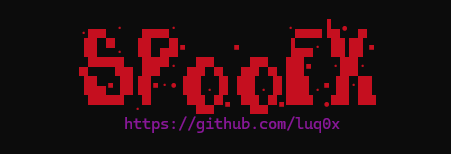
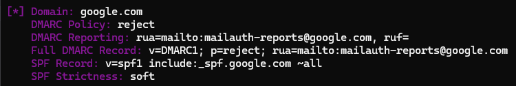

<h1 align="center">🕵️ spoofx - E-mail Spoofing Analyzer</h1>

<div align="center">
  
</div>

<br>

**spoofx** is a lightweight, high-performance CLI tool built in Go for identifying **email spoofing vectors** in domains through analysis of **SPF** and **DMARC** configurations.

Designed for **offensive security workflows** — especially for:

- 🔍 Bug bounty recon
- 🔥 Red team domain mapping
- 🧰 Security audits & SPF/DMARC compliance checks

---

## 🚀 Installation

```bash
go install github.com/luq0x/spoofx@latest
```

---

## ⚙️ Usage

### Scan a single domain:
```bash
spoofx -d example.com
```

### Scan from file:
```bash
spoofx domains.txt
```

### Scan via pipe:
```bash
subfinder -d example.com -silent | spoofx -v
```

---

## 🔎 Flags

| Flag        | Description                              |
|-------------|------------------------------------------|
| `-d`        | Scan a single domain                     |
| `-v`        | Enable verbose output                    |
| `-h`        | Show help / usage                        |

**Note:** Flags must come *before* the domain or file input.

---

## 📄 Output Example (Verbose Mode)

<div align="center">
  
</div>

---

## 🧾 HTML Report Generator

SpoofX now includes an **HTML tool to generate Markdown vulnerability reports** from your findings.  

📁 Available at: [`report/spoofx.html`](report/spoofx.html)

Just open the file in your browser and fill in:
- Target domain
- Spoofed email
- Inbox used
- Date

It will auto-generate a professional Markdown report for platforms like **HackerOne**, **Bugcrowd**, or internal security docs.

---

## ✅ What it does

- 🕵️ Fetches SPF & DMARC DNS records
- 🧠 Classifies SPF strictness: `strict`, `soft`, `neutral`, or `unknown`
- 🚨 Flags weak or missing policies
- ✍️ Provides optional HTML report generation

---

## 💥 Why use SpoofX?

- ⚡ Fast and lightweight (written in Go)
- 🧩 Works in recon chains (`cat`, `dnsx`, `httpx`)
- 🧰 CLI-based, no dependencies
- 🧾 Markdown report generation included
- 🎯 Perfect for Bug Bounty, Red Teaming, and Pentest Ops

---

## 🏷 Version

Current release: `v1.1.1`

---

## 🙌 Author

- 👨‍💻 [@luq0x](https://github.com/luq0x)

Pull requests, suggestions, or PRs to improve detection and automation are always welcome.
